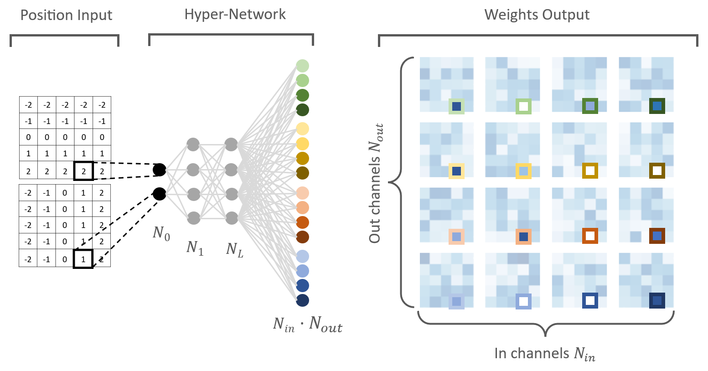

# Hyper-Convolutions tested on MNIST

This repository is the implementation used for the BlogPost of my seminar at TUM.

The paper version that this is based on was the paper uploaded on Arxiv: [Hyper-Convolutions via Implicit Kernels for Medical Imaging](https://arxiv.org/abs/2202.02701)
by Tianyu Ma, Alan Q. Wang, Adrian V. Dalca, Mert R. Sabuncu.

## Requirements
The python version used for this repository is 3.9.
All the required packages are listed in the `requirements.txt`

## Scripts
The main purpose of the repository is to get a deeper insight into how hyper-convolutions work and to get more visuals for my blogpost. The main scripts are the following:

* `main.py`: Containing the implementation of the Hyper-Convolution and doing all the training
* `noise_test.py`: Doing the same tests with noise as introduced in the paper
* `plot_conv_weights.py`: Plot the convolutional weights of a training model
* `plot_kernel_size_and_N_L_heatmap_from_paper.py`: Just plotting a table from the paper as a heatmap for better visualization
* `plot_training_graph`: Plotting the training- and validation loss for each epoch of models. Comparing the training process of normal and hyper convolutions

## Models
The repository contains 2 sets hyper and normal convolutions training results in the `lightning_logs` folder.
The `_old` versions are there just because those are the ones used for the weight plots in the blog post.
The other 2 folders contain the models used for the noise experiments.
Both `_old` and the other models have been trained with the same hyper parameters.